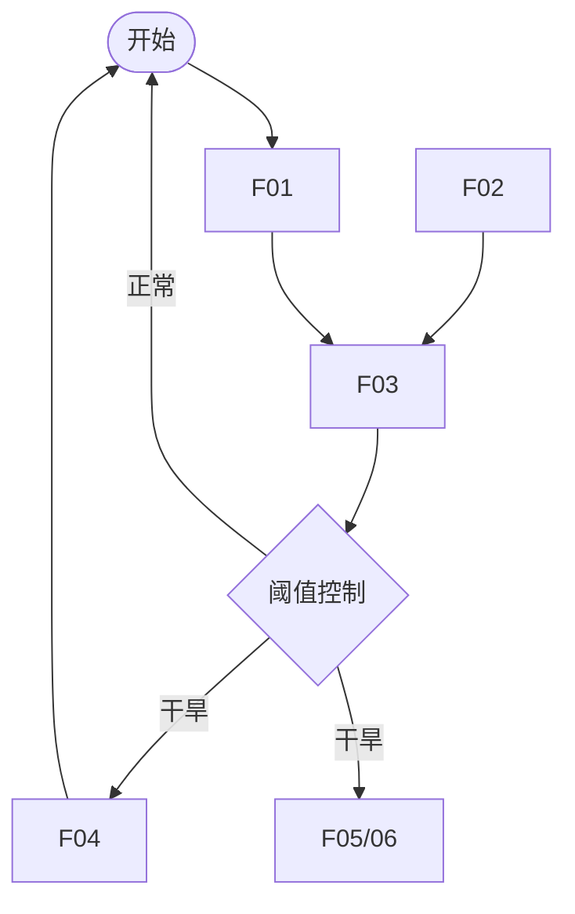

# 预防干旱设计说明文档

## 一、需求分析

### 1.1 问题背景
- [描述当前农业或植物种植中面临的干旱问题]
- [说明为什么需要这个预防干旱系统]

### 1.2 核心需求
- [列出系统需要解决的核心问题]
- [例如：及时检测干旱、自动化保水等]

### 1.3 功能目标
- [具体的功能目标列表]
- [预期达成的效果]

---

## 二、模块设计

### 2.1 模块概览
本装置共涉及三个核心模块，分别负责特定的功能循环，模块之间通过主控芯片协同。

### 2.2 各模块详细设计

#### 2.2.1 干旱监测模块

- **功能描述**：通过收集多模态的数据，协同矫正。将采集到的凝珠变色情况映射成为干旱度，反馈给系统核心。
- **设计原理**：主要变量为变色程度，环境因素如：气温、湿度、光照强度、色温、空气质量，作为矫正变量辅助变色程度对干旱度的映射。并通过持续时间提高反馈程度。最后将数据信息反馈给主控。
  - 其中图像部分由无线摄像头作为独立模块运转，进行基本的图像处理和信息提取。

    ```mermaid
    flowchart TD
        A[图像采集] --> B(图像处理)
        B -->|摄像单元控制器输出| C(数据分类)
        B2[环境数据] --> C
        C --> D[结果反馈]
    ```

- **硬件需求**：
  - 温湿度传感器-DHT30
  - 光谱强度传感器
  - 空气质量传感器-MQ系列
  - 摄像模块单元控制器-ESPcam系列
  - 电压比较器模块
- **接口定义**：
  - 内部：
    - 图像采集排线
  - 外部：
    - 温湿度信号
    - 光强信号
    - 空气信号
    - 变色信号

#### 2.2.2 补水抗旱模块

- **功能描述**：当接收到主控信号时，模块启动。通过水泵在植物根系附近实施补水。
- **设计原理**：水泵的启停。
- **硬件需求**：水泵。
- **接口定义**：输入水管；输出水管；信号排线。

#### 2.2.3 App报警模块（主控）

- **功能描述**：当接收到各项数据后，将数据拟合映射成干旱度数值。超过严重干旱的阈值后发出警报到用户，并启动补水抗旱模块。
- **设计原理**：收集所有信息并输出控制。
- **硬件需求**：ESP32-S3
- **接口定义**：信号排线，电源排线。

---

## 三、功能设计

### 3.1 功能列表

| 功能编号 | 功能名称     | 描述                                                                                               | 优先级 |
| -------- | ------------ | -------------------------------------------------------------------------------------------------- | ------ |
| F01      | 凝珠色度输出 | 通过摄像头采集植物根系附近图像，进行数字图像处理后提取蓝色信号强度，通过变色信号接口输出变色强度。 | P0     |
| F02      | 环境数据采集 | 接收所有环境信息传感器的数据并显示。                                                               | P0     |
| F03      | 数据拟合     | 通过所有已采集的数据，拟合出干旱模型。为数据预测&分类提供基础。                                    | P1     |
| F04      | 补水控制     | 通过控制信号能够灵敏的开关补水水泵。                                                               | P2     |
| F05      | 无线连接     | 通过无线协议实现用户终端设备与主控的连接，实现数据互传。                                           | P1     |
| F06      | App页面      | 实现一个App提供给用户一个查看数据与警报的平台。                                                    | P2     |
| F07      | 集群控制     | 多单元的互联通信，最终实现app连接一个终端、控制正片区域的状态。                                    | P3     |

### 3.2 功能逻辑流程



---

## 四、功能实现路径

### 4.1 技术路线

- [采用的核心技术]
- [技术选型依据]

### 4.2 实施步骤

1. [第一阶段：需求验证]
2. [第二阶段：原型开发]
3. [第三阶段：测试优化]
4. [第四阶段：部署应用]

### 4.3 关键里程碑
| 里程碑 | 目标日期 | 完成标准 | 状态   |
| ------ | -------- | -------- | ------ |
| M1     | [日期]   | [标准]   | 待完成 |
| M2     | [日期]   | [标准]   | 待完成 |
| M3     | [日期]   | [标准]   | 待完成 |

---

## 五、缺陷分析

### 5.1 已知限制
- [列出已知的系统限制]
- [说明为什么这些限制存在]

### 5.2 潜在风险
| 风险描述 | 发生概率   | 影响程度   | 应对策略 |
| -------- | ---------- | ---------- | -------- |
| [风险1]  | [高/中/低] | [高/中/低] | [策略]   |
| [风险2]  | [高/中/低] | [高/中/低] | [策略]   |

### 5.3 改进方向
- [短期的改进计划]
- [长期的优化方向]
- [预期的技术升级]

---

## 附录

### A. 参考资料
- [相关文档链接]
- [技术资料来源]

### B. 术语表
| 术语    | 定义   |
| ------- | ------ |
| [术语1] | [定义] |
| [术语2] | [定义] |